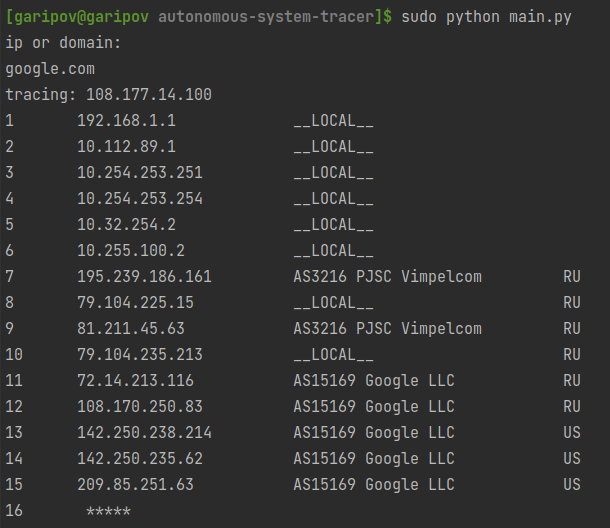

# Autonomous System Tracer (+country, provider)
## Usage:
1. Linux(on Windows may be troubles with ttl):
   ```
   [user@user]$ sudo python main.py
    ip or domain:
    google.com
    tracing: 108.177.14.100
    1       192.168.1.1             __LOCAL__        
   ...     
    
 